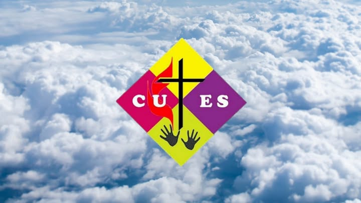

CUTES stands for **Catholic Undergraduate Teachers’ Society**. As Catholic
students attending Universiti Pendidikan Sultan Idris (UPSI), we form a vibrant
student community rooted in the parish of Most Holy Redeemer, Tanjung Malim.

Our members come together from all over Malaysia including Sabah, Sarawak, and
Peninsular Malaysia. Pursuing our studies across Diploma, Degree, Master’s, and
PhD programs, we find ourselves at a crucial transition where practicing our
faith becomes a personal choice. CUTES offers a welcoming spiritual and social
brotherhood and sisterhood so that no student has to navigate their university
years or faith journey alone.

## What we do

We serve the Sunset Mass, taking care of the liturgy, readings, choir, music,
and venue setup. After Mass, we always gather for meals to catch up and bond.

Outside the church, CUTES stays active through sports days, student outreach
programs, and community service in nearby villages. We also host the CUTES
Retreat, CUTES Family Day, and celebrate Gawai and Kaamatan to keep our East
Malaysian traditions strong on campus.

## What the logo means

- **The cross** — the sign of our salvation as Catholic students and as God's people.
- **The hands** — our service as students and as teachers.
- **The flame** — the burning red fire that carries our zeal to keep proclaiming the Gospel.
- **The colours, yellow, pink and purple** — the colours of festivity in the Liturgy.

## Joining CUTES

There are no registration forms to sign, once you step into UPSI, you are
officially part of the CUTES family! Just join us for Sunset Mass at 7:30 pm and
stay for food afterwards. If you'd like to get involved in serving or need any
support, our doors are always open, feel free to approach any member after Mass
or reach out directly to our coordinator via the [contact page](../contact).
